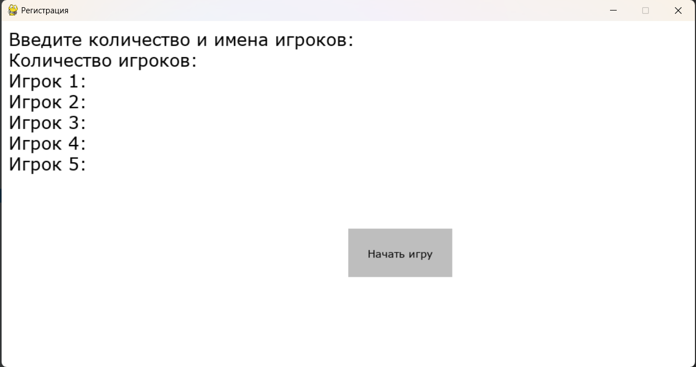
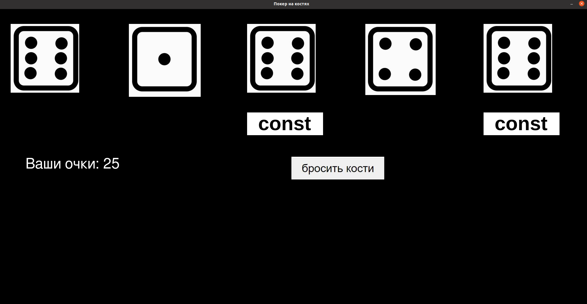

# Yahtzee
Desktop приложение Покер на костях

### Описание игры:
Играть могут от двух человек и более. Для игры используют 5 кубиков с числовыми достоинствами от 1 до 6. В зависимости от игровой ситуации выбрасываются от одного до пяти кубиков одновременно. За выполнение определённых комбинаций даются очки. Все комбинации и результаты их выполнения записываются в таблицу. 

Цель игры — набрать наибольшую сумму очков.

### Запуск приложения
При запуске приложения необходимо ввести количество пользователей и их имена. 

Пользователи ходят по очереди, на экран выводится очередность хода.
В свой ход игроку необходимо:
* Бросить кости
* Выбрать три кости которые не надо перебрасывать
* При желании перебросить оставшиеся две кости

### В ходе проекта реализовано
#### В первую итерацию:
* Основная страница игры с выводом на экран кубиков и кнопкой для броска
* Процесс игры: инициализация игроков, бросок кубика с равновероятным результатом, подсчет результатов
#### Во вторую итерацию:
* Страница регистрации
* Выбор кубиков, которые необходимо оставить без перебрасывания
* Вывод результатов на экран

